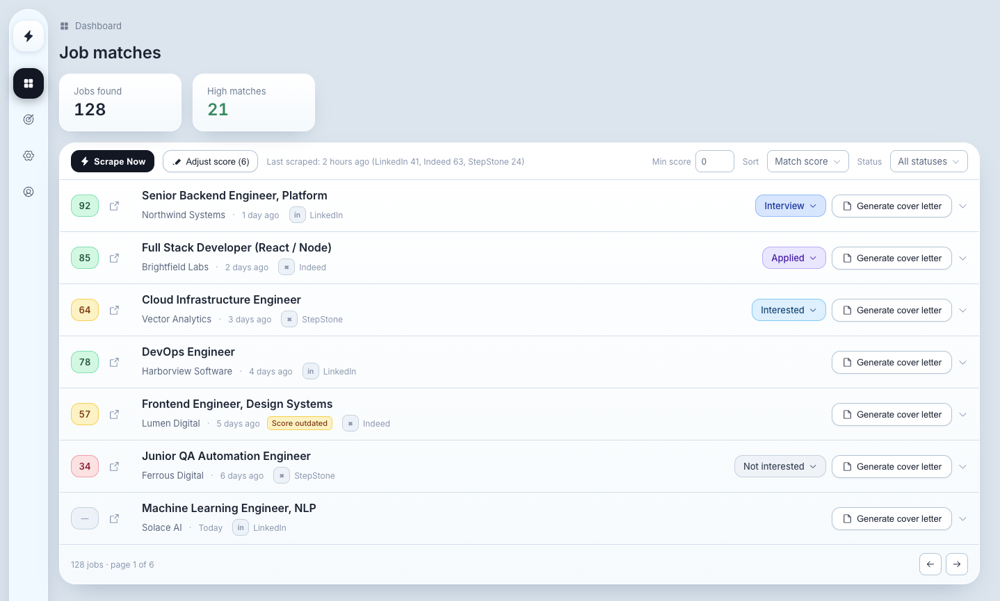

# AI Job Hunter

Scrapes job boards (Indeed, LinkedIn, Xing, Stepstone, Arbeitsagentur), scores matches against your
profile with an LLM, and helps you generate tailored cover letters. Track each job's application
status (interested, applied, interview, not interested) and filter the list by it. Built with
Next.js and Supabase.



## Setup

1. **Clone and install**
   ```bash
   git clone <this-repo>
   cd ai-job-hunter
   npm install
   ```

2. **Create a Supabase project** at [supabase.com](https://supabase.com), then run every file in
   `supabase/migrations/` against it, in order (via the Supabase SQL editor, or `supabase db push`
   if you use the Supabase CLI).

3. **Copy the env template** and fill in your Supabase project's URL, anon key, and service role
   key (Project Settings → API in the Supabase dashboard):
   ```bash
   cp .env.local.example .env.local
   ```

4. **Generate the two required app secrets** and paste them into `.env.local`:
   - `CREDENTIALS_ENCRYPTION_KEY` — encrypts any API keys you enter later via the Settings page:
     ```bash
     openssl rand -hex 32
     ```
   - `AUTH_PASSWORD_HASH` — the password that protects your deployment (nobody without it can
     reach the app):
     ```bash
     node -e "const c=require('crypto');const s=c.randomBytes(16).toString('hex');c.scrypt(process.argv[1],s,64,(e,k)=>console.log(s+':'+k.toString('hex')))" "your-password-here"
     ```

5. **Start the app** and log in with the password you hashed in step 4:
   ```bash
   npm run dev
   ```
   Open [http://localhost:3000](http://localhost:3000).

6. **Add your Apify and OpenRouter API keys** via Settings → API Keys in the app itself — no need
   to touch `.env.local` for these. (You can still set them as env vars instead if you prefer; the
   Settings UI values take priority when both are set.)

7. **Deploying**: always put this behind HTTPS (Vercel and most hosts do this automatically) — the
   login cookie is only meaningful over an encrypted connection.

## Deployment

The reference deployment runs on [Vercel](https://vercel.com), connected directly to this GitHub
repo — push to your default branch and it redeploys.

Set every variable from `.env.local.example` in **Project Settings → Environment Variables**. Use
the exact same `AUTH_PASSWORD_HASH` and `CREDENTIALS_ENCRYPTION_KEY` values you generated locally —
regenerating them on Vercel would lock you out of your own password and make any API keys already
stored in Supabase undecryptable.

The app is single-user by design: the password gate (`AUTH_PASSWORD_HASH`) is the only account
there is, there's no public sign-up or multi-user support.

## Automation (optional)

`POST /api/cron/scrape` runs a full scrape + score pass and waits for it to finish before
responding — unlike the "Scan now" button in the UI, which fires in the background. Point any
scheduler at it: a cron job, [n8n](https://n8n.io), Zapier, a scheduled GitHub Action, whatever
you already use. The app doesn't depend on a specific one.

1. Generate a secret and set it as `CRON_SECRET` in your env:
   ```bash
   openssl rand -hex 32
   ```
2. Call the endpoint with it as a bearer token, on whatever schedule you like:
   ```bash
   curl -X POST https://your-app.vercel.app/api/cron/scrape \
     -H "Authorization: Bearer $CRON_SECRET"
   ```
   Response: `{ "runId": "...", "jobsFound": 12, "jobsStored": 9, "jobsScored": 9, "notified": true }`

   Returns 401 if the bearer token is missing or doesn't match `CRON_SECRET`.

### Webhook notifications

Set `NOTIFICATION_WEBHOOK_URL` to have the app POST a summary of newly-scored high-fit jobs after
each cron run (leave it unset to skip this — the cron endpoint works fine without it). The score
threshold is set in Settings → Notifications (default 75). Each job is only ever notified once,
even if it gets rescored later. Any receiver that accepts a JSON POST works — a Slack/Discord
webhook relay, [webhook.site](https://webhook.site) for testing, your own endpoint, etc.

Payload shape:
```json
{
  "event": "new_jobs",
  "count": 1,
  "jobs": [
    {
      "title": "Senior React Developer",
      "company": "TechCorp GmbH",
      "url": "https://...",
      "platform": "indeed",
      "score": 87,
      "reasoning": "Matches React and TypeScript, remote, senior level",
      "postedDate": "2026-08-14"
    }
  ]
}
```

### Recommended settings for automated scraping

If you point a scheduler at the cron endpoint on a recurring basis (e.g. every 2 hours during work
hours), these starting values in Settings keep it useful without wasting Apify credits:

| Setting | Recommended value | Why |
|---|---|---|
| Results per scan | 20 | Covers realistic daily posting volume per portal without wasting Apify credits |
| Max posting age (days) | 2 | Keeps results fresh for time-sensitive applications, avoids re-scraping stale listings |
| Notification threshold | 75 | Only notifies on genuinely strong matches, avoids notification fatigue |

Tune these after a few days based on actual `scrape_runs` data (duplicate rate, jobs found vs.
stored).

## Security notes

- Row Level Security is enabled on every Supabase table, scoped to the single hardcoded app user —
  see `supabase/migrations/015_enable_rls.sql`.
- The cron endpoint bypasses the password gate (external schedulers can't hold a login cookie) but
  requires its own bearer token instead — never expose `CRON_SECRET` in client-side code.
- `NOTIFICATION_WEBHOOK_URL` has no built-in auth on the receiving end by default — treat the URL
  itself as a secret; anyone who has it can see your job matches.

## Learn More

Built with [Next.js](https://nextjs.org) and [Supabase](https://supabase.com).
